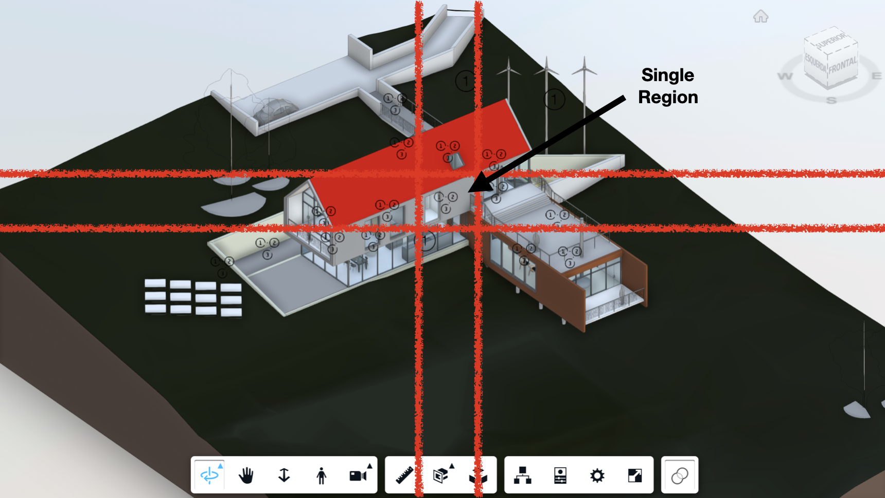

# Group Labels sample


[](http://opensource.org/licenses/MIT)

[](http://developer.autodesk.com/)
[](http://developer.autodesk.com/)

This sample demonstrates how to group sprites to improve visualization in context of the APS Viewer.

### DEMO: https://autodesk-platform-services.github.io/aps-grouplabels-sample/

### Introduction

When we start adding labels to our scenes, we might get to a point where it gets too crowded. It is at this point that we need to think of a way to improve visualization without limiting the number of annotations added to the scene. This is the goal of this sample. It shows a way to achieve that grouping of sprites depending on the camera orientation.


### The approach

We choose to implement this approach with [sprites](https://aps.autodesk.com/en/docs/dataviz/v1/developers_guide/examples/sprites/), but the same logic can also be aplied to html markups or any other type of annotation, as long as it relies in points (in the scene or in the client).
With sprites, we can easily specify a size for our labels (in pixels), so they can adjust themselves based on the camera orientation (looking bigger in comparision with our scene elements).
So, to summarize, we'll take advantage of sprites to add our labels and adjust our scene in a way thet it doesn't get too populated with labels, grouping them when necessary.

### The math behind the scene

To make it work, we'll need a way to group the label that are overlaping.

We'll need to reapply this strategy each time the camera changes, since its orientation defines the way we see the labels.

This comparision will consider the distance between the labels in a 2D context (client coordinates).

#### From 3D scene points to 2D points

First thing we need to to is converting the 3D points into 2D points relative to the client units in pixels.
This can be achieved with the help of viewer's [worldToClient](https://aps.autodesk.com/en/docs/viewer/v7/reference/Viewing/GuiViewer3D/#worldtoclient-point-camera) method.

#### Grouping the points

For this part performance matters, since we'll be grouping on a camera change basis.
We can loop through the points to separate them into groups that are close to each other (depending on the defined treshold).
The logic works like we're dividing the screen into a grid of regions with the specified width and height. Inside any area, we can have only one single label being displayed (representing either a group or a single sprite).


In this sample we're doing that with the help of the snippet below:

```js
findIndexGroups() {
  let indexGroups = [];
  for (let i = 0; i < spritesPositions.length; i++) {
    let currentPosition = this.viewer.worldToClient(spritesPositions[i]);
    const currentIndexColumn = Math.floor(currentPosition.x / this.treshold);
    const currentIndexRow = Math.floor(currentPosition.y / this.treshold);
    if (!indexGroups[currentIndexRow]) {
      indexGroups[currentIndexRow] = [];
    }
    if (!indexGroups[currentIndexRow][currentIndexColumn]) {
      indexGroups[currentIndexRow][currentIndexColumn] = [];
    }
    indexGroups[currentIndexRow][currentIndexColumn].push(i);
  }
  return indexGroups.flat();
}
```

The `findIndexGroups` method returns an array of arrays with indexes that should be displayed as a single label.
Dividing a point clientX by the area width we can know in which column this point is located.
Dividing a point clientY by the area heigth we can know in which row this point is located.
Then we can add this point (in this case just its index) into the proper group.

Once the groups are defined, we can render themm using a specific icon for groups, while we use a different one for individual points.



We handle this part with the snippet below:

```js
renderSprites(dbId, indexGroups) {
  let DataVizCore = Autodesk.DataVisualization.Core;
  this.dataVizExtn.removeAllViewables();
  this.viewableData = new DataVizCore.ViewableData();
  this.viewableData.spriteSize = 32;

  for(let indexGroup of indexGroups){
    dbId++;
    let spritePoint;
    let spriteStyle;
    if(indexGroup.length > 1){
      spritePoint = this.findMiddlePoint(indexGroup);
      spriteStyle = this.pointStyles[1];
    }
    else{
      spritePoint =  spritesPositions[indexGroup[0]];
      spriteStyle = this.pointStyles[0];
    }
    let viewable = new DataVizCore.SpriteViewable(spritePoint, spriteStyle, dbId);
    this.viewableData.addViewable(viewable);
  }

  this.viewableData.finish().then(() => {
    this.dataVizExtn.addViewables(this.viewableData);
  });
}
```

#### Regroup on camera change

We need to repeat this process every time the camera changes, so we're basically trigerring this through the [CAMERA_CHANGE_EVENT](https://aps.autodesk.com/en/docs/viewer/v7/reference/Viewing/#camera-change-event)

The result from that can be seen by the gif below:


## License

This sample is licensed under the terms of the [MIT License](http://opensource.org/licenses/MIT). Please see the [LICENSE](LICENSE) file for full details.

## Written by

João Martins [in/jpornelas]([http://twitter.com/JooPaulodeOrne2](https://www.linkedin.com/in/jpornelas/)), [APS Partner Development](http://aps.autodesk.com)
